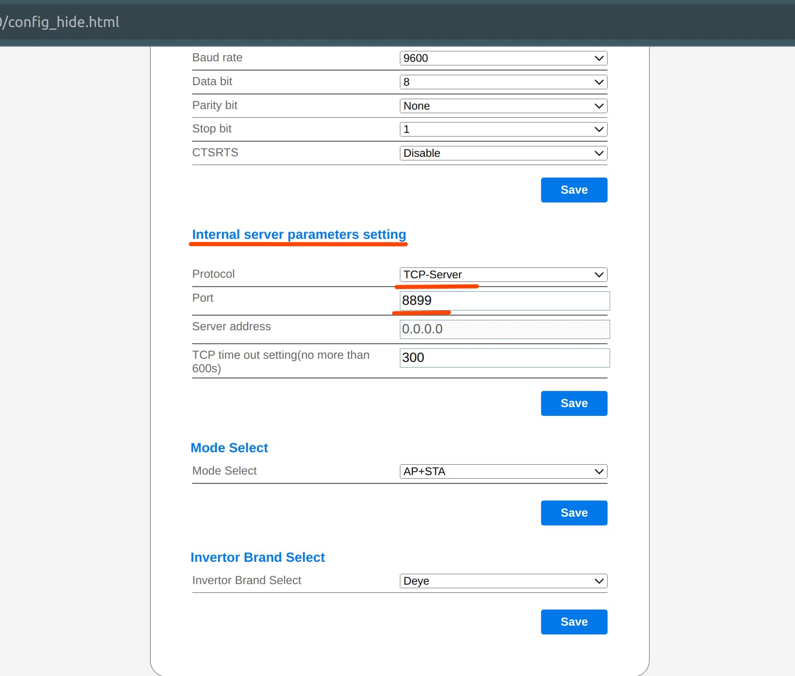
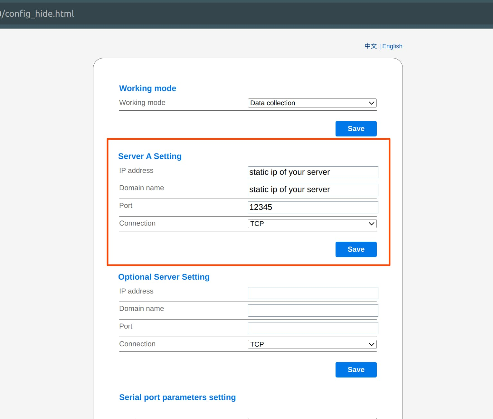
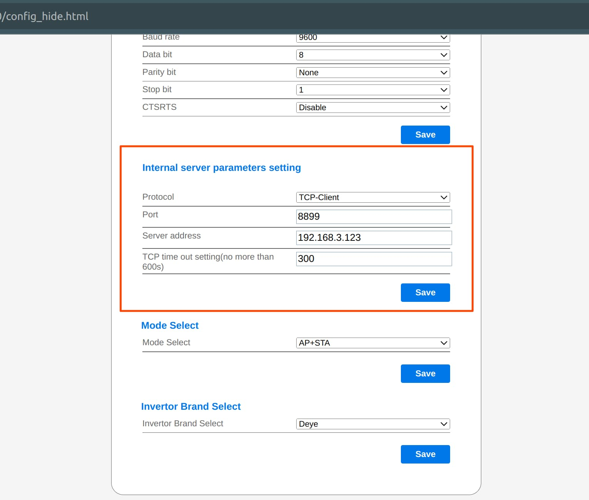
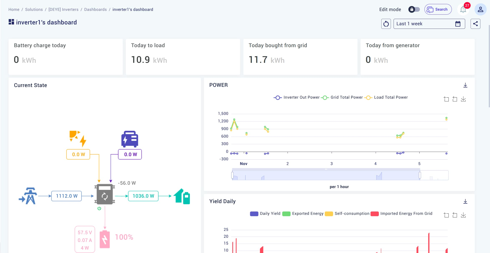
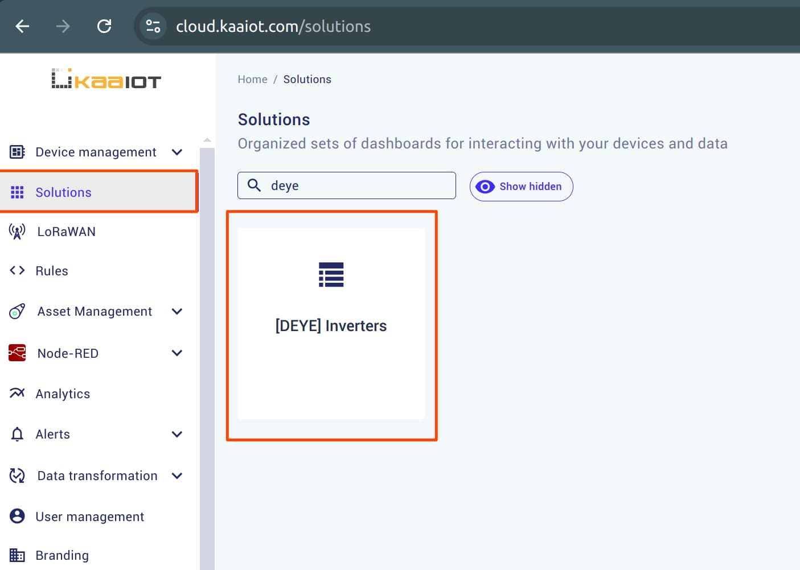

# DEYE MQTT Client

This example integrates the [Deye SUN-12K-SG04LP3-EU](https://www.deyeinverter.com/deyeinverter/2024/02/03/instructions_sun-5-12k-sg04lp3-eu_240203_en.pdf) hybrid inverter with the KAA platform. It utilizes the [deye-controller](https://github.com/githubDante/deye-controller) library to fetch data from the inverter and then uses `kaa_mqtt_client` to send data to the KAA platform.


## Configuring Deye Inverter

You can connect to the **Deye Web UI** via a local network or through a TCP proxy. I'll show you how to configure it in both ways.

### Local Network

1. Navigate to Deye's settings by going to `{your_inverter_ip}/config_hide.html`.
2. Scroll down to **Internal server parameters setting**.
3. Set **Protocol** to `TCP-Server` and **Port** to `8899`.
4. Save the settings.



This will enable the MQTT client to read data from the Deye inverter over your local network.

### TCP Proxy

For remote access, you will need a **server with a static IP**. We'll use [go-solarman-proxy](https://github.com/githubDante/go-solarman-proxy) as the TCP proxy, which requires [Go](https://go.dev/doc/install) to run. This setup allows you to send data to a remote server without being restricted to the local network where the inverter is installed.

1. Navigate to `{your_inverter_ip}/config_hide.html`.
2. Under **Server A Settings**, set both **IP address** and **Domain Name** to your static server's IP. Choose a port, such as `12345`.
   
3. In **Internal server parameters setting**, set **Protocol** to `TCP-Client`, **IP** to the desired IP (such as `192.168.3.123`), and **Port** to `8899`.
   
4. Download and install [go-solarman-proxy](https://github.com/githubDante/go-solarman-proxy) according to the documentation.
5. Launch the proxy with the following command:

   ```bash
   go-solarman-proxy 0.0.0.0 12345
   ```

If the connection is successful, this will link the Deye logger to your server. The proxy will then allow the MQTT Client to read data from the Deye logger.


## Launching Deye MQTT Client

### Environment Variables

This project requires the following environment variables to work properly:

```bash
export IP="{local-or-proxy-ip}"
export SERIAL_NUMBER="{your-deye-device-serial-number}"
export DEFAULT_KPC_HOST="mqtt.cloud.kaaiot.com"
export DEFAULT_KPC_PORT="1883"
export APPLICATION_VERSION="{your-application-version}"
export ENDPOINT_TOKEN="{your-endpoint-token}"
```

- **IP**: If you're connecting **locally**, use the IP address found in the `index_cn.html` file under the **Device Information** tab. For a **proxy setup**, set the IP to `localhost`.

- **DEFAULT_KPC_HOST**, **DEFAULT_KPC_PORT**, **APPLICATION_VERSION**, and **ENDPOINT_TOKEN**: These values can be found in the `./examples/simple_client` directory of this repository. Refer to this example for a working configuration.  

### Running the Project

To start the project, install required libraries by executing:

```bash
pip install -r requirements.txt
```

Then insert the environment variables into your terminal and execute `main.py`.


## (Optional) Viewing Your Data with Kaa Dashboard

You can use the Kaa dashboard to create a custom UI to view your data and go beyond the default device page.


### Add envoriment variables

This part requires the `TENANT_ID` and `APPLICATION_NAME` variables to work:

```bash
export TENANT_ID="{your-tenant-id}"
export APPLICATION_NAME="{your-application-name}"
```

Add them and restart the program to apply changes.

### Creating a Dashboard

In Kaa console open the **Solutions** tab. A solution is automatically created for each application, but you can create a new one if needed.  
   

### Quick Start

To keep things simple, here’s a quick example. After running the `python3 main.py` script, a JSON template will be generated using the environment variables you provided earlier. To apply the template, follow these steps:

1. In the top right corner, click **Import Dashboard**.
2. Navigate to the `./template/output` folder and copy the code from `device_overview.json`.
3. Paste the code into the import dialog.

You should now see a dashboard similar to the one shown at the beginning of this section.
