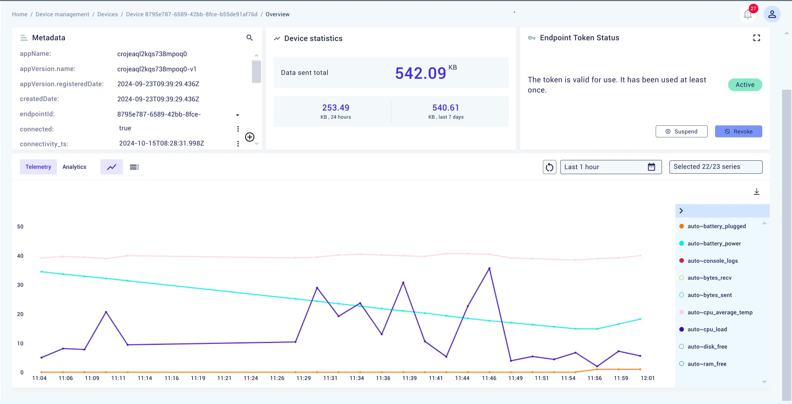
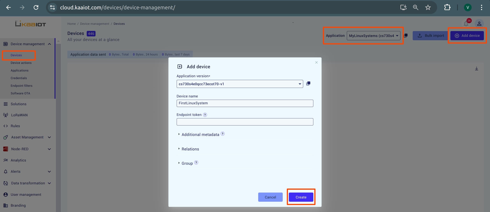
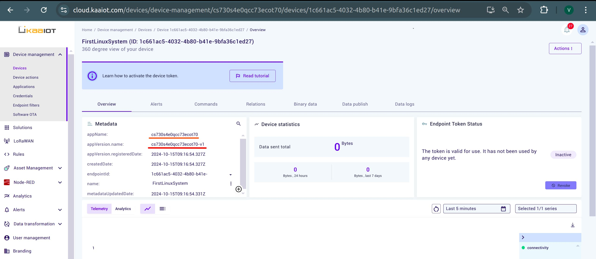
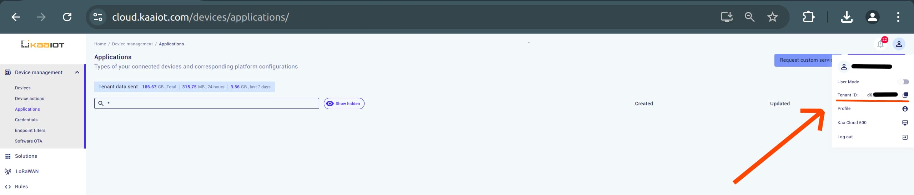
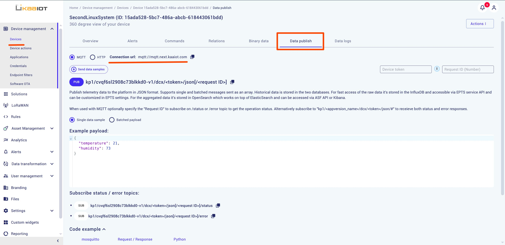
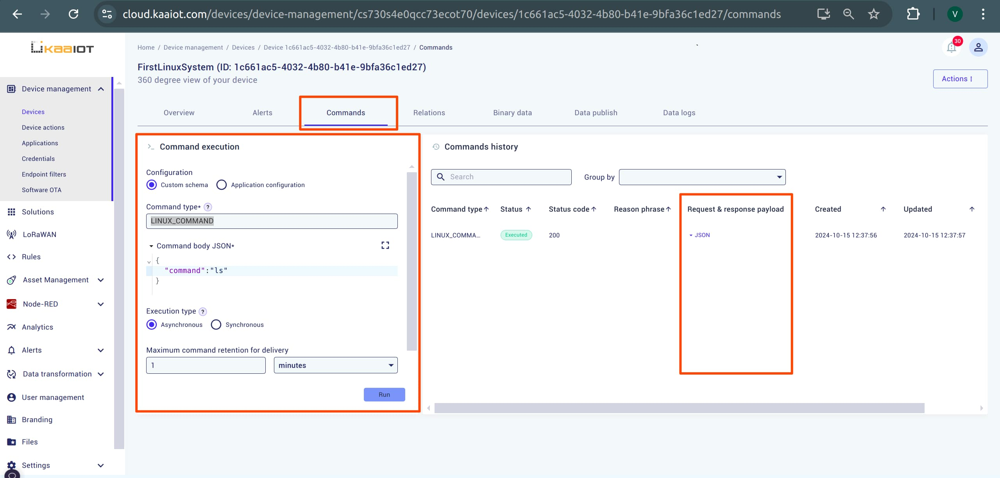
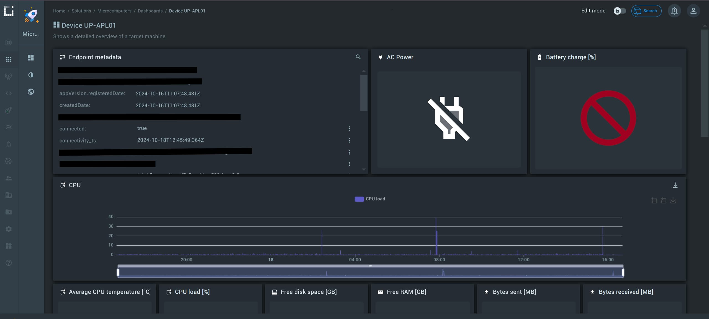

# Linux System Scanner

This project implements the Kaaiot API to provide remote access and system scanning for your Linux machine. The code utilizes tools like `cpuinfo`, `psutil`, `GPUtil`, and `subprocess`, continuously scanning your Linux system and sending the data to Kaaiot via MQTT. From Kaaiot, you can view the data as an endpoint and execute console commands without the need for a static IP.




## Installation

To get started with the project, follow these steps:

1. Ensure Python is installed on your system:

    ```bash
    sudo apt install python3.12-venv
    pip install setuptools
    ```

2. Install the project using the following commands:

   ```bash
   git clone https://github.com/kaaproject/mqtt-client-python
   cd mqtt-client-python
   python3 -m venv env
   source env/bin/activate
   cd examples/linux_sys_scan/
   pip install -r requirements.txt
   ```


## Launch the Project

Start the project by running:

```bash
python3 main.py
```

Upon your first launch, you may encounter a several errors:


The program scans your system and attempts to send the data, but it doesn't know where to send it due to missing environment variables such as `DEFAULT_KPC_HOST`, `APPLICATION_VERSION`, `APPLICATION_NAME`, `TENANT_ID` and `ENDPOINT_TOKEN`. 
Here’s how to get them.


## Setting Up Environment Variables

To resolve the issue, you need to create a new application and an endpoint. The application acts as a storage for your Linux servers, providing default settings for each one. Within this application, you will create an endpoint to receive and view generated data, as well as to execute commands remotely.

### Steps to Create an Application

1. **Open Kaa console**: Navigate to the Applications tab, choose a name for your application, and create it.
   

2. **Add a Device**: In the Devices tab, select your application from the dropdown and click "Add device". Choose a name for the device and create it.
   

3. **Copy the Token**: You will be greeted with a token. Copy it. That is `ENDPOINT_TOKEN`, 1 out of the 5 required variables.
   

4. **Get Application Version**: Open your newly created device and copy the `appVersion.name` and `appName`. This will be `APPLICATION_VERSION` and `APPLICATION_NAME`, which are the 3 out of 5 variables.
   

5. **Get Tenant ID**: In the top right corner, click on `profile icon` and copy `Tenant ID`. That's 4 out of 5.
   

6. **Get Default KPC Host**: 
   On the device page, follow these steps:

   - Navigate to **Data Publish**.
   - Check the **MQTT** option.
   - Copy the resulting URL.

    

   Next, remove `mqtt://` from the URL. You should end up with something like this: `mqtt.cloud.kaaiot.com`. 

   This value is your `DEFAULT_KPC_HOST`, which is the last variable.


## Provisioning Your Python Script

Here's an example of the credentials you should provide. Replace the placeholder values with your own and copy the result into your terminal:

```bash
export DEFAULT_KPC_HOST="mqtt.cloud.kaaiot.com"
export DEFAULT_KPC_PORT="1883"
export APPLICATION_NAME="{your-application-name}"
export APPLICATION_VERSION="{your-application-version}"
export ENDPOINT_TOKEN="{your-endpoint-token}"
export TENANT_ID="{your-tenant-id}"
```

Now you can launch the program with `python3 main.py`, and hopefully, you will start receiving data.


## Executing Commands

In your device page, navigate to the Commands section. You can execute terminal commands from Kaa and view the output in JSON format. To do this:

1. Set "Command type" to `LINUX_COMMAND`.
2. As an example payload, send:

```json
{"command": "ls"}
```




## Viewing Your Data with Kaa Dashboard (Optional)

You can use the Kaa dashboard to create a custom UI to view your data and go beyond the default device page.

### Creating a Dashboard

Open the **Solutions** tab. A solution is automatically created for each application, but you can create a new one if needed.  
   

    
### Quick Start

To keep things simple, here’s a quick example. After running the python3 main.py script, a JSON template will be generated using the environment variables you provided earlier. To apply the template, follow these steps:

1. In the top right corner, click **Import Dashboard**.
2. Navigate to the `./dashboards/output` folder and copy the code from `device_overview.json`.
3. Paste the code into the import dialog.
4. (OPTIONAL) This dashboard can execute Docker commands. To use this feature, you need to install Docker on your machine. Follow the instructions [here](https://github.com/docker/docker-install).

You should now see a dashboard similar to the one shown below:  



## Conclusion
This is it! From this point, you should hopefully be able to execute commands and view data about your Linux system from KaaIot. Thank you for following this guide and i hope that it was useful to you.